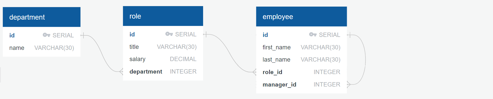

# Employee Tracker

This is a command-line application that allows you to manage employee data, including departments, roles, and employees. The app uses PostgreSQL as its database and Inquirer to prompt the user through the terminal interface. The application allows you to view and manage employee data with a series of interactive prompts.




## Features

The application supports the following functionality:

- **View all departments**: View a table listing all departments with their department names and IDs.
- **View all roles**: View a table listing all roles with job titles, role IDs, departments, and salaries.
- **View all employees**: View a table of employees with their IDs, names, job titles, departments, salaries, and managers.
- **Add a department**: Add a new department by specifying its name.
- **Add a role**: Add a new role by specifying the role's title, salary, and department.
- **Add an employee**: Add a new employee by specifying their first name, last name, role, and manager.
- **Update an employee role**: Select an employee to update and assign them a new role.

## Requirements

- Node.js (version 14 or higher)
- PostgreSQL (for the database)
- `inquirer` package (for interactive prompts)

## Installation

1. **Clone the repository**:
   ```bash
   git clone https://github.com/yourusername/employee-tracker.git
2. **Install dependencies**:
- npm i

3. **Set up PostgreSQL database**:
- Create a PostgreSQL database (e.g., employee_tracker_db).
- Set up the appropriate tables for departments, roles, and employees in your database. You can use the provided SQL scripts in db/schema.sql to create the tables.

## Usage
- Once the app is installed and configured, you can start it by running the following command:
- npm start
- You will then be presented with a series of prompts where you can select from the options


## Contributing
- Fork the repository.
- Create a new branch (git checkout -b feature/your-feature).
- Make your changes and commit them (git commit -am 'Add new feature').
- Push to the branch (git push origin feature/your-feature).
- Open a Pull Request.

## License
This project is licensed under the MIT License - see the LICENSE file for details.